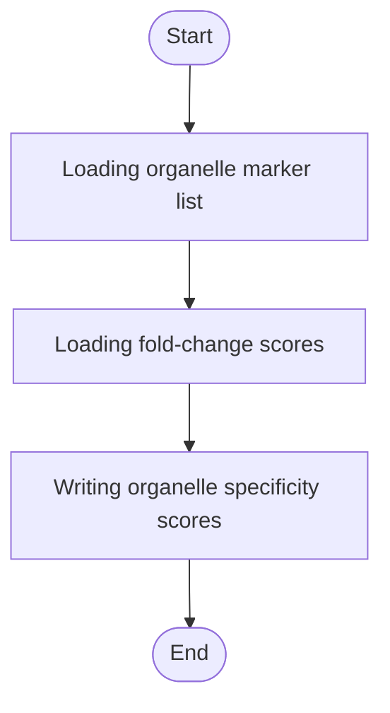

# Lyso-IP Organelle Specificity


## Installation

**[⬇️ Click here to install in Cauldron](http://localhost:50060/install?repo=https%3A%2F%2Fgithub.com%2Fnoatgnu%2Flysoip-organelle-specificity-plugin)** _(requires Cauldron to be running)_

> **Repository**: `https://github.com/noatgnu/lysoip-organelle-specificity-plugin`

**Manual installation:**

1. Open Cauldron
2. Go to **Plugins** → **Install from Repository**
3. Paste: `https://github.com/noatgnu/lysoip-organelle-specificity-plugin`
4. Click **Install**

**ID**: `lysoip-organelle-specificity`  
**Version**: 1.0.0  
**Category**: lysoip-qc  
**Author**: CauldronGO Team

## Description

Rewards a curated marker protein enriched toward IP, penalizes it more heavily if enriched toward WCL instead


## Workflow Diagram



## Runtime

- **Environments**: `python`

- **Entrypoint**: `lysoip_organelle_specificity.py`

## Inputs

| Name | Label | Type | Required | Default | Visibility |
|------|-------|------|----------|---------|------------|
| `differential_expression_file` | Differential Expression | file | Yes | - | Always visible |
| `organelle_list` | Expected Organelle List | select (LSD (Platt 2018) (53 genes), Lysosome (Hein 2025) (158 genes), LSD + Lysosome (180 genes), ER (Hein 2025) (349 genes), Golgi (Hein 2025) (87 genes), Endosome (Park and Itzhak 2022) (93 genes), Mitochondria (Rath 2021) (1136 genes), Ribosome (Nakao 2004) (80 genes), Nucleus (Leung 2006) (410 genes)) | Yes | LSD + Lysosome | Always visible |
| `reward` | Reward | number (min: 0, step: 0) | No | 1 | Always visible |
| `penalty` | Penalty | number (min: 0, step: 0) | No | 2 | Always visible |

### Input Details

#### Differential Expression (`differential_expression_file`)

differential_expression.tsv from the Lyso-IP Differential Expression plugin


#### Expected Organelle List (`organelle_list`)

Curated marker-gene list bundled with this plugin, converted from lysoip_qc_framework's Curated Organelle Protein Lists.xlsx

- **Options**: `LSD (Platt 2018)` (LSD (Platt 2018) (53 genes)), `Lysosome (Hein 2025)` (Lysosome (Hein 2025) (158 genes)), `LSD + Lysosome` (LSD + Lysosome (180 genes)), `ER (Hein 2025)` (ER (Hein 2025) (349 genes)), `Golgi (Hein 2025)` (Golgi (Hein 2025) (87 genes)), `Endosome (Park and Itzhak 2022)` (Endosome (Park and Itzhak 2022) (93 genes)), `Mitochondria (Rath 2021)` (Mitochondria (Rath 2021) (1136 genes)), `Ribosome (Nakao 2004)` (Ribosome (Nakao 2004) (80 genes)), `Nucleus (Leung 2006)` (Nucleus (Leung 2006) (410 genes))

#### Reward (`reward`)

Multiplier applied to abs(fold_change) for a marker enriched toward IP


#### Penalty (`penalty`)

Multiplier applied to abs(fold_change) for a marker enriched toward WCL instead


## Outputs

| Name | File | Type | Format | Description |
|------|------|------|--------|-------------|
| `organelle_specificity` | `organelle_specificity.tsv` | data | tsv | Per-protein organelle specificity score for marker genes only (non-members are untested, not zero) |

## Requirements

- **Python Version**: >=3.11

## Example Data

This plugin includes example data for testing:

```yaml
  differential_expression_file: examples/differential_expression.tsv
  organelle_list: LSD + Lysosome
```

Load example data by clicking the **Load Example** button in the UI.

## Usage

### Via UI

1. Navigate to **lysoip-qc** → **Lyso-IP Organelle Specificity**
2. Fill in the required inputs
3. Click **Run Analysis**

### Via Plugin System

```typescript
const jobId = await pluginService.executePlugin('lysoip-organelle-specificity', {
  // Add parameters here
});
```
